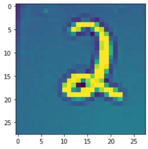
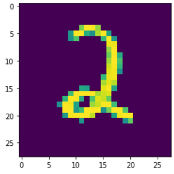
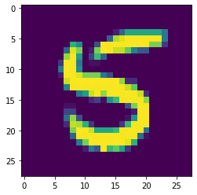
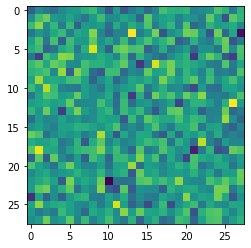
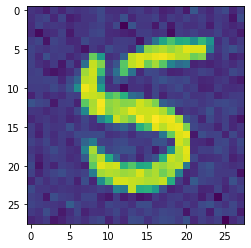
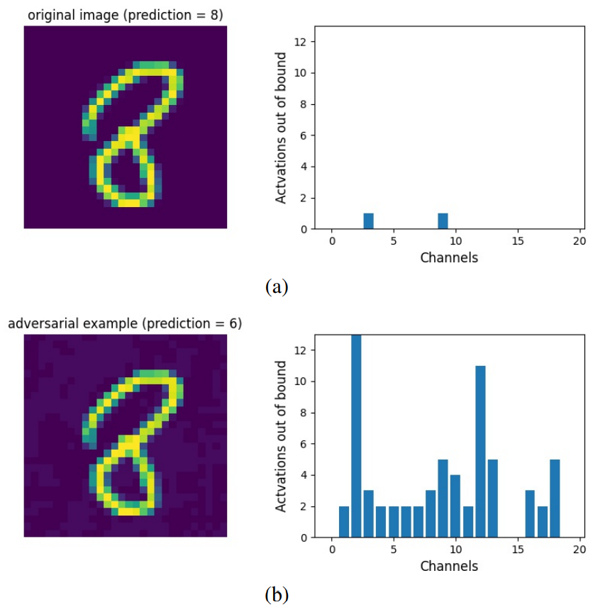

# Testing Deep Learning Models

This project was part of the 2021 [Advanced Software Testing seminar](https://www.cs.cit.tum.de/sse/lehre/software-qualitaet/) at the Technical University of Munich. 

The goal of this seminar paper ([pdf](Testing_DL_Models_seminar_paper.pdf)) was to compare compare state-of-the art methods for testing Deep
Learning models with each other and with other, more traditional approaches to software testing.
In the first part a brief introduction to feedforward neural networks is given and
various properties relevant to testing these systems are explained and illustrated with examples.
In the second part the concepts presented are applied by putting the robustness of an [open-source MNIST classification model](https://github.com/dangeng/Simple_Adversarial_Examples) to the test.

Please Note:
- the code for model and generation of adversarial examples originates from the linked repository and was adapted for this project
- it is kept as simple as possible and doesn't use a framework like PyTorch or Tensorflow in order to fully control every part of the model

In addition, neuron activation metrics for adversarial attack detection ([proposed in this 2021 paper](https://arxiv.org/abs/2101.12100)) are explored and re-implemented.

This project was graded with 1.3 (with 1 beeing the best and 4 the worst passing grade)

# Application

## Pipeline

One can capture live footage of handwritten digits with a camera (e.g. smartphone).
These digits are processed and put into a format the neural network can use.

| raw capture | cropping & normalizing | treshhold filter |
|---------|------------------------------|------------------|
|     |   |  |

The model will predict these digits with high accuracy as they are very similar to the ones in the MNIST dataset.

## The Problem with Adversarial Attacks

When creating a so-called adversarial attack, even a model with high test accuracy can be fooled because the robustness of a model is not easy to determine.

For example, a digit five can be combined with an attack pattern that fools the model.
This attack pattern is constructed with back-propagation so that the model classifies it with any label of ones choosing without having to resemble the class at all to the human eye.
([read this](https://christophm.github.io/interpretable-ml-book/adversarial.html) for a more detailed introduction of adversarial examples)

The resulting image gets misclassified with high probability on the wrong label.

| source img | attack pattern | finished adversarial example |
|---------|------------------------------|------------------|
|     |   |  |

This can be a serious problem in other applications of Deep Learning, such as Traffic Sign Classification, because of the safety-critical nature of the predictions (see this project of mine).

## Confidence through Analysis of Neuron Coverage

In 2021 Guilio et al. proposed [a novel approach](https://arxiv.org/abs/2101.12100) to increase the confidence in DNNs by analyzing the coverage of the neurons in forward passes during developement.

The idea is to document how different input classes activate individiual neurons differently.
For each class, an aggregated pattern is constructed according to a so-called "Coverage Analysis Methods" (e.g. interval of all observed activation values). For more details, please see my seminar paper or the original paper.
The hypothesis is that adverserial attacks cause unusual activity within neurons and an attack can be detected.

In the plot below, one can see the difference in neuronal activity between the pre-recorded activation ranges and the live values in the forward pass of the corresponding example. Example a) is the original captured image, and b) is the adversarial attack generated from a). The channels are the activation ranges per neuron in one of the hidden layers.
- the attack pattern used here is very subtle, so please note the slightly discolored spots in the background

It can be concluded that the adversarial attack on the lower image causes a strong deviation from the recorded behaviour that is usually observed with other images of the predicted class.

## Conclusion

The results show that [the approach of Guilio et al.](https://arxiv.org/abs/2101.12100) is able to detect adversarial attacks in context of the MNIST digit classification.
Therfore traditional testing metrics like test coverage can be modified and used within the domain of Deep Learning.
By taking a look inside the black box, neuron coverage could provide relevant insights in the workings of DNN's and make AI more understandable.

